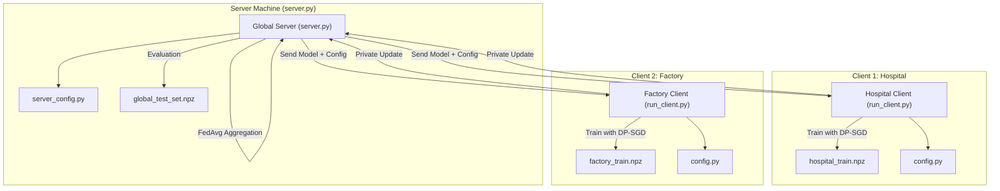

# **FED_IIDS: A Differentially Private Federated Intrusion Detection System**

### *Privacy-Preserving Network Intrusion Detection Using Federated Deep Learning*

**Author:** *Abhinav Ranjan*

---

# **1. Abstract**

FED_IIDS is a federated, privacy-preserving intrusion detection framework designed for distributed environments where organizations cannot share raw network traffic data. The system enables multiple institutions—such as hospitals and manufacturing plants—to collaboratively train a high-performance intrusion detection model while retaining full local data ownership and protecting individual records with Differential Privacy (DP-SGD).

The project demonstrates the complete lifecycle of a federated NIDS: non-IID data engineering, feature reduction through correlation and LightGBM ranking, deep neural network modeling, differentially private optimization, and secure federated aggregation using the Flower framework. FED_IIDS is designed as a research platform to study federated behavior under realistic conditions, including catastrophic forgetting, data skew challenges, and cross-domain generalization.

The accompanying **[TECHNICAL_REPORT.md](./TECHNICAL_REPORT.md)** contains detailed architectural, algorithmic, and experimental documentation.

---

# **2. Research Motivation**

Modern distributed networks face challenges that make centralized data collection impractical:

### Regulatory Constraints

Laws such as **GDPR** and **HIPAA** strictly limit the sharing of network logs that may contain sensitive information.

### Data Silos

Organizations generate valuable intrusion data but cannot share it, resulting in weaker isolated detection systems.

### Non-IID Data

Attack patterns differ significantly across industries:

* A hospital primarily sees spoofing and web-based attacks.
* A factory faces DoS, DDoS, Mirai botnet traffic.

Single-domain IDS models fail to generalize across these environments.

### Privacy Guarantees

Even sharing trained model gradients can leak information due to reconstruction and membership inference attacks.

---

### **FED_IIDS addresses all of these through:**

* Federated training without transferring private logs.
* Cross-organizational learning from heterogeneous attack patterns.
* Differential privacy for mathematically provable client-level confidentiality.
* A realistic Non-IID benchmark for studying catastrophic forgetting.

---

# **3. Key Contributions**

This project delivers several research-grade contributions:

### **3.1 Non-IID Federated IDS Benchmark**

Two highly diverse client environments:

* **Client 1 (Hospital)**: Benign, Spoofing, Web-Based attacks
* **Client 2 (Factory)**: Benign, DoS, DDoS, Mirai, Recon

### **3.2 Differential Privacy Integration**

Client-side training with:

* Gradient clipping
* Gaussian noise addition
* DP-Adam optimizer for strict record-level guarantees

### **3.3 Lightweight IDS Feature Engineering Pipeline**

A reproducible notebook (Fed_IIDS.ipynb) that:

* Cleans and normalizes 1.6M+ flows
* Applies correlation filtering
* Performs LightGBM-based feature ranking
* Reduces the feature space from 74 → 30

### **3.4 End-to-End Federated Training Pipeline**

A complete Flower-based FL system with:

* Dynamic config distribution
* Secure, noise-protected local training
* Weighted FedAvg aggregation
* Global and local evaluation after each round

---

# **4. System Architecture Overview**

FED_IIDS follows a modular, multi-machine client–server design.

## **4.1 Architecture Diagram (Mermaid)**



A full breakdown of this architecture is provided in **[TECHNICAL_REPORT.md](./TECHNICAL_REPORT.md)**.

---

# **5. Installation and Setup**

Clone the repository:

```
git clone https://github.com/letsbegincode/Fed_IIDS.git
cd Fed_IIDS
```

Create and activate environment:

```
python -m venv venv
.\venv\Scripts\activate
```

Install dependencies:

```
pip install -r client/requirements.txt
```

Prepare the dataset:

1. Run **Fed_IIDS.ipynb**
2. Generate the five `.npz` files
3. Place them in:

```
Fed_IIDS/client/data/
```

---

# **6. Running the System**

All commands must be executed from the root folder.

### **6.1 Start the Server**

```
python server.py
```

### **6.2 Start Client 1 (Hospital)**

```
python -m client.run_client --client-id hospital
```

### **6.3 Start Client 2 (Factory)**

```
python -m client.run_client --client-id factory
```

Training will automatically begin once the minimum required clients connect.

---

# **7. Research Insights**

### Catastrophic Forgetting

Training on only one non-IID client (e.g., hospital) causes severe forgetting. Accuracy collapses when tested on unseen attack types such as Mirai.

### Federated Generalization

Training with both heterogeneous clients resolves this. FedAvg successfully merges specialized domain expertise into a generalized global IDS.

### Differential Privacy Behavior

DP-SGD imposes:

* Computational overhead
* Accuracy reduction at higher noise levels
* Strict constraints on batch sizes and validation parameters

The DP-related Keras bug was fixed by replacing `validation_split` with `validation_data`.

Full experimental analysis is in **TECHNICAL_REPORT.md**.

---

# **8. License**

This project is licensed under the MIT License.  
See the full license text here: **[LICENSE](./LICENSE)**.

---

# **9. Citation**

If you use FED_IIDS in your research, please cite:

```bibtex
@software{ranjan_fed_iids_2025,
  author = {Abhinav Ranjan},
  title = {FED\_IIDS: A Differentially Private Federated Intrusion Detection System},
  year = {2025},
  publisher = {GitHub},
  journal = {GitHub repository},
  howpublished = {\url{https://github.com/letsbegincode/Fed_IIDS}}
}
```

---

# **10. Additional Documentation**

The following document contains complete, in-depth details:

## **[TECHNICAL_REPORT.md](./TECHNICAL_REPORT.md)**

(Architecture, Data Pipeline, Model Details, FL Workflow, Evaluation Methodology, Results)

---

