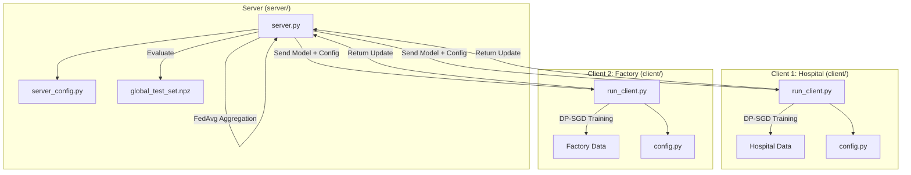

# **FED_IIDS: A Differentially Private Federated Intrusion Detection System**

### *Privacy-Preserving Network Intrusion Detection Using Federated Deep Learning*

**Author: Abhinav Ranjan**

---

# **1. Abstract**

**FED_IIDS** is a federated, privacy-preserving intrusion detection framework designed for distributed environments where organizations cannot share raw network traffic logs. The system allows institutions—such as hospitals and manufacturing plants—to collaboratively train a global Intrusion Detection System (IDS) while maintaining full ownership of their private datasets.

FED_IIDS implements the complete lifecycle of a federated IDS, including:

* Non-IID data engineering
* Feature reduction with correlation filtering and LightGBM ranking
* Deep neural network–based classification
* Differentially Private SGD (DP-SGD) on clients
* Secure federated coordination using the Flower framework

A detailed technical explanation of the system architecture, algorithms, and experimental evaluation is available in **[TECHNICAL_REPORT.md](./TECHNICAL_REPORT.md)**.

---

# **2. Research Motivation**

Centralized intrusion detection pipelines face significant challenges:

### **Privacy and Compliance Constraints**

Regulations such as GDPR and HIPAA prevent sharing sensitive network data.

### **Data Silos**

Organizations accumulate valuable intrusion data but cannot pool it.

### **Domain-Specific Attack Distributions (Non-IID)**

* Hospitals experience spoofing and web-based attacks.
* Factories encounter DoS, DDoS, Mirai, and Recon traffic.

A single-domain IDS fails to generalize across environments.

### **Privacy Guarantees**

Even model gradients can leak training data through inference attacks.

---

### **FED_IIDS addresses these barriers by:**

* Enabling collaborative IDS training **without moving data**
* Leveraging diverse attack patterns across organizations
* Applying **Differential Privacy** to protect each client’s data
* Providing a realistic benchmark for studying catastrophic forgetting

---

# **3. Key Contributions**

### **3.1 Non-IID Federated IDS Benchmark**

Two heterogeneous clients simulate real-world domain skew:

* **Client 1 (Hospital):** Benign, Spoofing
* **Client 2 (Factory):** Benign, DoS, DDoS, Mirai, Recon

### **3.2 Differential Privacy Integration**

Client-side training uses:

* Gradient clipping
* Gaussian noise addition
* DPKerasAdamOptimizer from `tensorflow-privacy`

### **3.3 Data Engineering Pipeline**

Implemented in **Fed_IIDS.ipynb** (Colab link below).
Includes:

* Cleaning + normalization
* Correlation-based filtering
* LightGBM-based feature ranking
* Feature reduction: **74 → 30 features**

### **3.4 End-to-End Federated Pipeline**

* Configurable server and clients
* Cross-client weighted FedAvg aggregation
* Global and local evaluations each round

---

# **4. System Architecture Overview**

FED_IIDS follows a **decoupled client–server design** supplemented by a shared API contract that defines the model architecture and feature dimensions.

---

## **4.1 Final Project Structure**

```
Fed_IIDS/
│
├── client/
│   ├── run_client.py
│   ├── nids_client.py
│   ├── config.py
│   ├── data_loader.py
│   ├── requirements.txt
│   ├── standalone_test.py
│   └── data/
│       ├── client_hospital_train.npz
│       ├── client_hospital_test.npz
│       ├── client_factory_train.npz
│       ├── client_factory_test.npz
│
├── server/
│   ├── server.py
│   ├── server_config.py
│   └── data/
│       └── global_test_set.npz
│
├── shared/
│   ├── model.py
│   └── model_config.py
│
├── outputs/
│   ├── server_terminal_output.txt
│   └── client_terminal_output.txt
│
├── Fed_IIDS.ipynb
├── TECHNICAL_REPORT.md
└── README.md
```

---

## **4.2 Architecture Diagram (Mermaid Compatible)**



Full architectural details are available in **TECHNICAL_REPORT.md**.

---

# **5. Installation and Setup**

### **Clone the Repository**

```
git clone https://github.com/letsbegincode/Fed_IIDS.git
cd Fed_IIDS
```

### **Create Virtual Environment**

```
python -m venv venv
.\venv\Scripts\activate
```

### **Install Dependencies**

```
pip install -r client/requirements.txt
```

---

# **6. Data Preparation**

### **Colab Notebook (Data Generation Pipeline)**

The full preprocessing notebook used to generate all `.npz` files:

**Google Colab (View Mode):**
[https://colab.research.google.com/drive/1gb8MZQ5IooUB7BXmIzm5J9QSgOituJFi?usp=sharing](https://colab.research.google.com/drive/1gb8MZQ5IooUB7BXmIzm5J9QSgOituJFi?usp=sharing)

This notebook performs:

* CSV aggregation
* Cleaning & normalization
* Feature engineering
* Non-IID splits
* `.npz` file generation

### **Place the generated files as follows:**

#### **Client files →**

```
Fed_IIDS/client/data/
```

#### **Server test set →**

```
Fed_IIDS/server/data/
```

---

# **7. Running the System**

All commands must be run from the **root folder**.

### **7.1 Start the Server**

```
python -m server.server
```

### **7.2 Start Client 1 (Hospital)**

```
python -m client.run_client --client-id hospital
```

### **7.3 Start Client 2 (Factory)**

```
python -m client.run_client --client-id factory
```

Training begins automatically once the minimum clients connect.

---

# **8. Sample Output**

The **outputs/** directory includes reference logs:

* `server_terminal_output.txt`
* `client_terminal_output.txt`

Useful for debugging and verifying correct operation.

---

# **9. Research Insights**

### **9.1 Catastrophic Forgetting**

Single-client training fails on unseen attack types (e.g., Mirai).
Federated training resolves this issue.

### **9.2 Differential Privacy Effects**

DP-SGD introduces noise and overhead, requiring careful batch configuration.

### **9.3 Global vs Local Performance**

The global model improves steadily through federated rounds, outperforming single-client baselines.

Full results are in **TECHNICAL_REPORT.md**.

---

# **10. License**

This project is licensed under the MIT License.
See: **[LICENSE](./LICENSE)**

---

# **11. Citation**

If you use FED_IIDS in your research, please cite:

```
Abhinav Ranjan, "FED_IIDS: A Differentially Private Federated Intrusion Detection System", 2025.
GitHub Repository: https://github.com/letsbegincode/Fed_IIDS
```

---

# **12. Additional Documentation**

See the full technical paper:

**[TECHNICAL_REPORT.md](./TECHNICAL_REPORT.md)**

---
